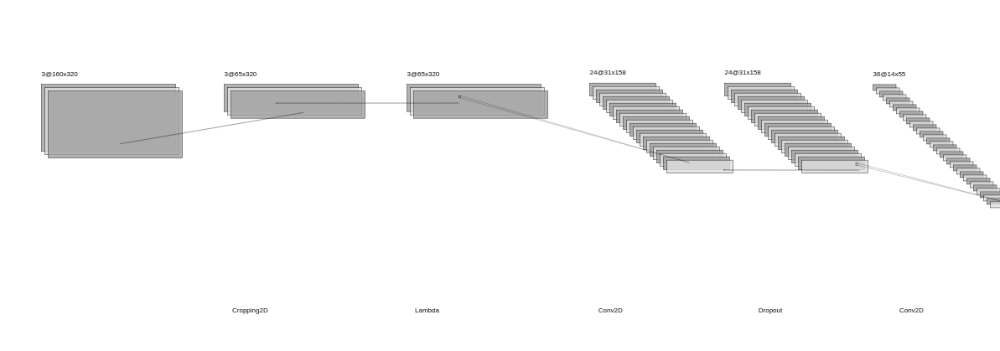

# **Behavioral Cloning**

In this project, we built a convolutional neural network that predicts steering angles from camera images that allows a car to drive autonomously in a simulator.

## Overview

The steps of this project are the following:
- Use the simulator to collect data of good driving behavior
- Build, a convolution neural network that predicts steering angles from images
- Train and validate the model with a training and validation set
- Test that the model successfully drives around track one without leaving the road

## Pipeline

### Data Collection

Data collection is key to this project. To gather enough data that covers a wide range of scenarios, we drove the car in the simulator with the following tactics:

- Drive two laps, trying to stay in the center.
- Drive one lap, trying to drift slightly to the left and right, then recover to the center. We only record the recovery phase.
- Drive one lap, trying to drift to the edge, then recover to the center. Again we only record the recovery phase.
- Drive one more lap, recording only when driving smoothly around curves.
- Do the steps above again while driving in the opposite direction.

Recovery laps help the vehicle to learn to recover when go astray. Curve driving helps balancing the data because most of the time the vehicle is driving straight. Drving in the opposite direction also helps balancing the data because the vehicle would do more left turns than right turns otherwise.

### Data Augmentation

First, we augment the camera data by using the left and right cameras along with the center camera. We added/subtracted a correction value to the steering angle to get the augmented steering angle for the left/right cameras.

Then, we flip all images and negated the steering angle to get the augmented steering angle for the flipped image. The data set consist of both the original set and the flipped set.

Finally, split the data set 80% for the training set and 20% for the validation set.

### Model Architecture

The model is based on [Nvidia's paper](http://images.nvidia.com/content/tegra/automotive/images/2016/solutions/pdf/end-to-end-dl-using-px.pdf) with some modifications.

We used a cropping layer to crop out the top and bottom portion of the image since they are not so interesting to the task. They capture trees and hills or the hood of the car.

We also used a lambda layer to normalize the data. This helps the model to train more efficiently.

To reduce overfitting, we added dropout layers after convolution layers with 0.3 dropout rate.

In summary, the model has a cropping layer, followed by a lambda normalization layer, followed by 3 stacks of convolution+dropout layers, followed by 2 convolution layers, then a flatten layer, and finally 4 fully connected layers.

We used an adam optimizer. A learning rate is not necessary.

### Model Evaluation

Training and validation loss vs epoch

### Driving in the Simulator

The vehicle is able to drive autonomously around the track without leaving the road. The trajectory is actually smoother than my manual driving trajectory. [Full video](./video.mp4)

## Potential Shortcomings

The model is not able to drive on the second track very well. I think it could be due to the second track having a different environment objects, having slopes. 
## Possible Improvements

In order to train a model to drive well on the second track, we think a few things can be done:
- Train on the second track. However, in practice, there will always be roads that are unseen before. We couldn't possibly train on every road. So the model needs to be able to generalize to new roads.
- We can use a technique called [domain randomization](https://arxiv.org/pdf/1703.06907.pdf). We can randomize lighting conditions, environment object colors, etc. This can help the model to capture what is the most important information for driving well.

I plan to revisit the project when time permits.
## Run

To build the model:
`python3 model.py`

To drive autonomously in the simulator:
`python3 drive.py model.h5`